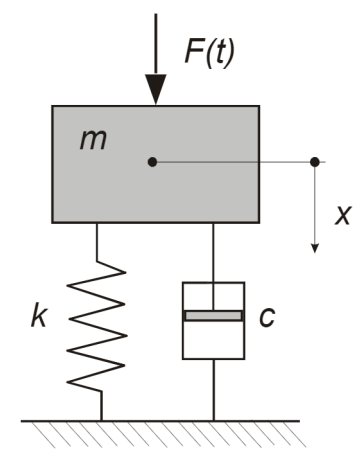
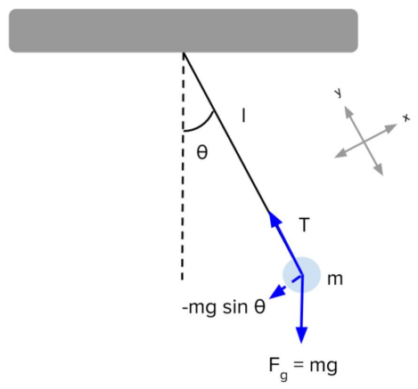

# Model Decisions

In this section, we are going to focus on **modelling decisions** - the decisions made by us. *And what is the main advantage of this?*  We will start seeing models as part of the creative and decision making process!

### Dynamic vs Static

 In classical mechanics, as you know, motion is governed by Newton's laws - the second law in particular - that allow us to write the famous main equation of motion that we know for years:

$$\underbrace{\sum_i^n F_i}_{\text{sum of all external forces}} = \overbrace{m\textbf{a}}^{\text{inertial terms}}$$

This equation can be tricky to solve: it is dynamic and nonlinear... However, it is also possible to simplify it! This is, depending on the problem we are solving I can make some assumptions and simplify my model, so it does still give answers to our question but it is simple enough to be computationally inexpensive and interpretable. And there is where the decisions start...
 
 In mechanics, usually we have to choose between static and dynamic models to solve certain problems. What's the difference?

#### Dynamic model

The response of a dynamic system will have a dependence on the past and future states.

Let us consider the mass-spring system as a first example. For this system, Newton's equations of motion sketch as:

$$F-c\frac{dx}{dt}-kx = m\frac{d^2x}{dt^2} \Leftrightarrow m\frac{d^2x}{dt^2} + c\frac{dx}{dt}+kx = F$$ 

#### Static model

In a static model, we consider the response of the system only depending on present values. This is, the model does not account for previous time steps.

If the terms with the derivatives are small and negligible when compared to $x$, then we find the following equation of motion:

$$\frac{d^2x}{dt^2},\frac{dx}{dt} << x \implies kx = F$$

**Under which circumstances does this occur?**

* *Slow loading rate:* constant $F$ or $F\cos(\omega t)$ if $\omega<\omega_0$, where $\omega_0$ is the natural frequency of the system

* Small mass and small values of the damping constant, $c$

Therefore, in those circumstances, we can make the assumption that the model is static (simplification) and still get accurate answers to our questions.

### Linear vs Nonlinear

Let us consider one of the most typical Physics examples: the simple pendulum. 

The moment equation around the pivot point corresponds to a **nonlinear dynamic model**:

$$\frac{d^2\theta}{dt^2} + \frac{g}{l}\sin\theta=0$$

**However...** it can be linearized around a stable position, where we use $\sin\theta \approx \theta$. This assumption is reasonable when the motion of the pendulum is small compared to the length of the pendulum. Thus, the equation of motion will become:

$$\frac{d^2\theta}{dt^2} + \frac{g}{l}\theta = 0$$

**And what are the consequences?**

In linear models, superposition principle applies and the long term behavior does not depend on initial conditions. On the contrary, in non-linear models, superposition principle does not apply anymore and long and short term behavior highly dependent on the initial conditions.

### Time-invariant vs Time-variant

It is clear that all systems that we know are time-variant, i.e., their state changes with time, whether that change is over a **short or a long-time scale** (or both). Let us see some examples of changes in both short and long-time scales:

**Changes in short-time scale in Civil Eng. systems:**

* Human behavior in traffic system
* Wind turbines in operational conditions

**Changes in long-time scale in Civil Eng. systems:**

* Civil infrastructures (bridges, buildings, etc.) due to damage (even though they also change in a short-time scale during extreme events)

**And what are the consequences?**

In time-invariant models, the model coefficients or model parameters are constant, while in time-variant models, the model parameter do change over time.

### Deterministic vs Stochastic

All systems, in reality, are stochastic to our eyes, since we never truly know the actual properties and inputs. However, under certain circumstances, this *stochasticity* can be neglected. Let us take a look to some examples of deterministic and stochastic systems:

**Cases of stochastic systems:**

Structures with known or unknown properties subject to unknown or known loads, respectively:

* Soil systems: we can extract samples of soil but we cannot see or measure the properties of every point in the system.
* Traffic systems: inputs are too complicated, from weather to human decisions.

**Cases of deterministic systems:**

Known structures subject to known static or dynamic loads. This only happens if the modeler decides that the variability of the system or the loads is low and has very little influence on the model outcome. For instance, when we decide to model the response of a building (deformations) under a certain wind load.

**And what are the consequences?**

Deterministic models will always produce the same output for a given input, while stochastic models will produce different outputs for a given input: **uncertainty** has a big role! 
